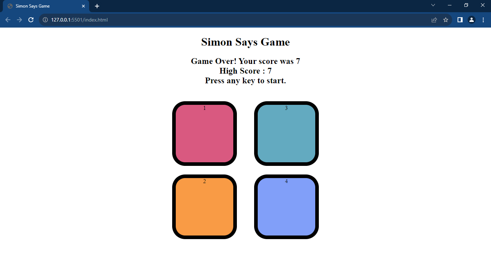

# Simon Says Game

Welcome to Simon Says Game project! This interactive memory-based game is built using HTML, CSS, and JavaScript, providing a fun and challenging experience for users to test their memory skills. I developed this project as part of my ongoing journey to improve my JavaScript skills.

## Game Overview

- **Objective:** Repeat the sequence of button flashes in the correct order as they appear on the screen.
- **Levels:** The game progresses through multiple levels, increasing in difficulty.
- **Game Over:** Incorrectly pressing a button ends the game, revealing the player's final score.

## Technologies Used

- HTML
- CSS
- JavaScript

## How to Play

1. Open the [Simon Says Game](link-to-your-game) in your web browser.
2. Press any key on the keyboard to start the game.
3. Pay attention to the sequence of button flashes and replicate it by clicking the corresponding buttons.
4. The game will advance to higher levels as you successfully complete each sequence.
5. The game ends when an incorrect button is clicked.

## Demo

## Learning Experience

I built this project as a practical exercise to reinforce my JavaScript skills, focusing on concepts such as event handling, DOM manipulation, and game logic.

Feel free to explore the code, try out the game, and provide any feedback. I appreciate your time in checking out this Simon Says Game!

## Author

Rishabh Rander
